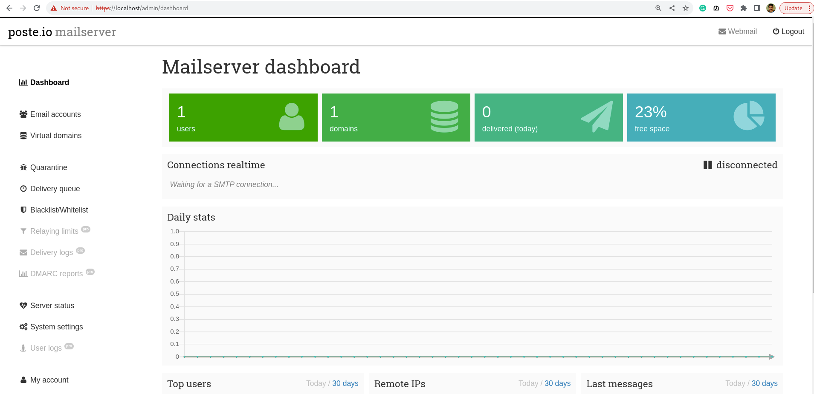
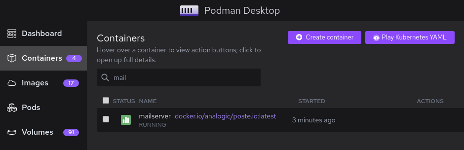
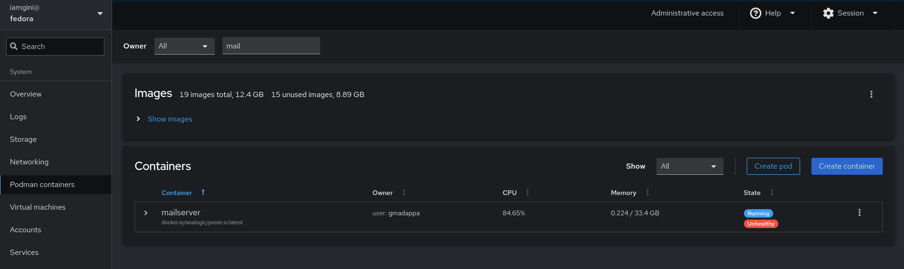

# Mail server using Podman

## Start the mailserver container

```shell
podman run -d --net=host -e TZ=Asia/Singapore -v ${PWD}/mailserver:/data:Z -it --name mailserver -h mail.example.org analogic/poste.io
```

Check container status

```shell
$  podman ps
CONTAINER ID  IMAGE                               COMMAND     CREATED        STATUS                    PORTS       NAMES
6f1aac52a922  docker.io/analogic/poste.io:latest              2 minutes ago  Up 2 minutes (unhealthy)              mailserver
```

## Configure mailserver with Podman and Systemd

```shell
$ cd $HOME/.config/systemd/user
$ podman generate systemd --new --files --name mailserver
/home/iamgini/.config/systemd/user/container-mailserver.service

# Reload the daemon
$ systemctl --user daemon-reload
```

Start the `container-mailserver.service` service and verify

```shell
$ systemctl --user is-active container-mailserver.service
inactive
$ systemctl --user start container-mailserver.service
$ systemctl --user is-active container-mailserver.service
active

$  systemctl --user status container-mailserver.service
● container-mailserver.service - Podman container-mailserver.service
     Loaded: loaded (/home/iamgini/.config/systemd/user/container-mailserver.service; disabled; preset: di>
    Drop-In: /usr/lib/systemd/user/service.d
             └─10-timeout-abort.conf
     Active: active (running) since Wed 2023-07-12 15:44:58 +08; 1min 16s ago
       Docs: man:podman-generate-systemd(1)
   Main PID: 3503709 (conmon)
      Tasks: 1 (limit: 38175)
     Memory: 732.0K
        CPU: 219ms
     CGroup: /user.slice/user-1000.slice/user@1000.service/app.slice/container-mailserver.service
             └─3503709 /usr/bin/conmon --api-version 1 -c 0f81d5bb7eeb48e23f47260578b493be9d276ea71359a08d4>

Jul 12 15:46:12 iamgini mailserver[3503709]: 
Jul 12 15:46:13 iamgini mailserver[3503709]: [-] PROGRAM ABORT : pcap_open_live: wlp0s20f3: You don't have>
Jul 12 15:46:13 iamgini mailserver[3503709]:          Location : prepare_pcap(), p0f.c:526
Jul 12 15:46:13 iamgini mailserver[3503709]: 
Jul 12 15:46:14 iamgini mailserver[3503709]: [-] PROGRAM ABORT : pcap_open_live: wlp0s20f3: You don't have>
Jul 12 15:46:14 iamgini mailserver[3503709]:          Location : prepare_pcap(), p0f.c:526
Jul 12 15:46:14 iamgini mailserver[3503709]: 
Jul 12 15:46:15 iamgini mailserver[3503709]: [-] PROGRAM ABORT : pcap_open_live: wlp0s20f3: You don't have>
Jul 12 15:46:15 iamgini mailserver[3503709]:          Location : prepare_pcap(), p0f.c:526
Jul 12 15:46:15 iamgini mailserver[3503709]: 
```

Sample systemd file:

```shell
# container-mailserver.service
# autogenerated by Podman 4.5.1
# Wed Jul 12 15:39:12 +08 2023

[Unit]
Description=Podman container-mailserver.service
Documentation=man:podman-generate-systemd(1)
Wants=network-online.target
After=network-online.target
RequiresMountsFor=%t/containers

[Service]
Environment=PODMAN_SYSTEMD_UNIT=%n
Restart=on-failure
TimeoutStopSec=70
ExecStart=/usr/bin/podman run \
	--cidfile=%t/%n.ctr-id \
	--cgroups=no-conmon \
	--rm \
	--sdnotify=conmon \
	--replace \
	-d \
	--net=host \
	-e TZ=Asia/Singapore \
	-v /home/iamgini/workarea/podman-usecases/podman-mailserver/mailserver:/data:Z \
	-it \
	--name mailserver \
	-h mail.example.org analogic/poste.io
ExecStop=/usr/bin/podman stop \
	--ignore -t 10 \
	--cidfile=%t/%n.ctr-id
ExecStopPost=/usr/bin/podman rm \
	-f \
	--ignore -t 10 \
	--cidfile=%t/%n.ctr-id
Type=notify
NotifyAccess=all

[Install]
WantedBy=default.target
```

## Access mailserver dashboard


See the container in Podman Desktop



## Manage container from GUI

See the container in Podman Desktop



See the container in Cockpit




```
sudo sysctl -w net.ipv4.ip_unprivileged_port_start=80
```
